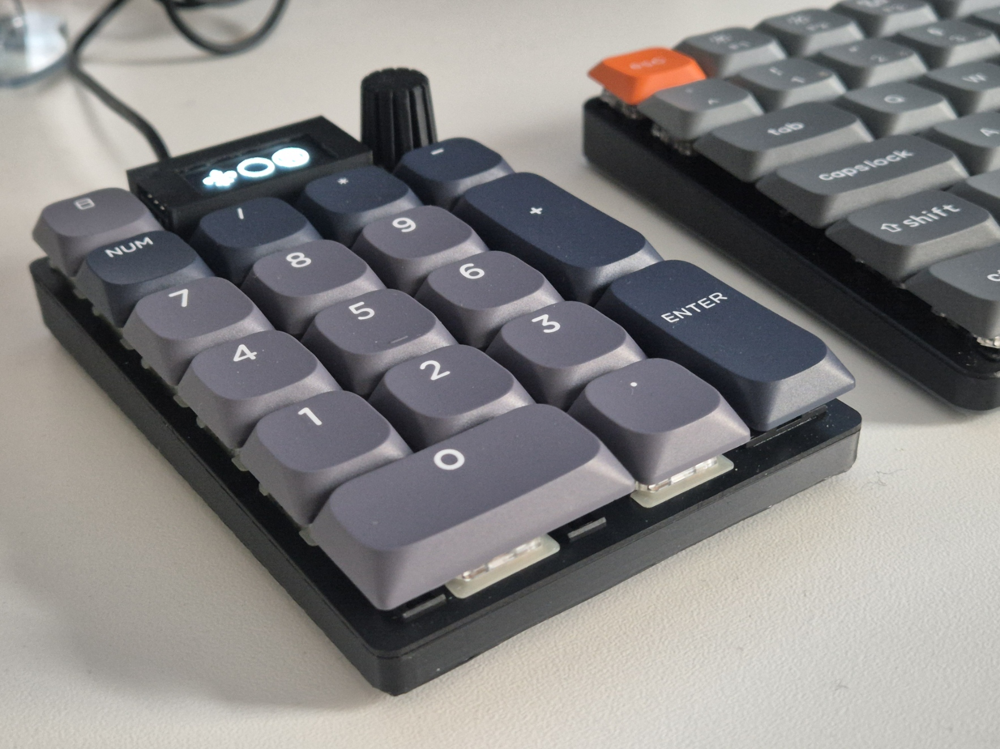
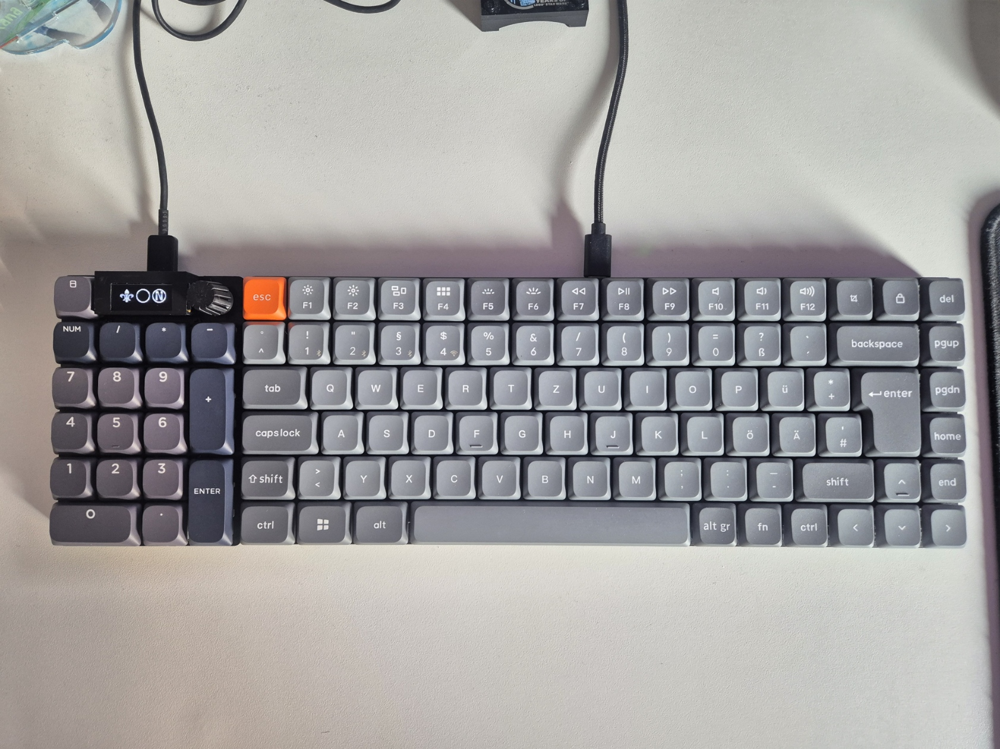
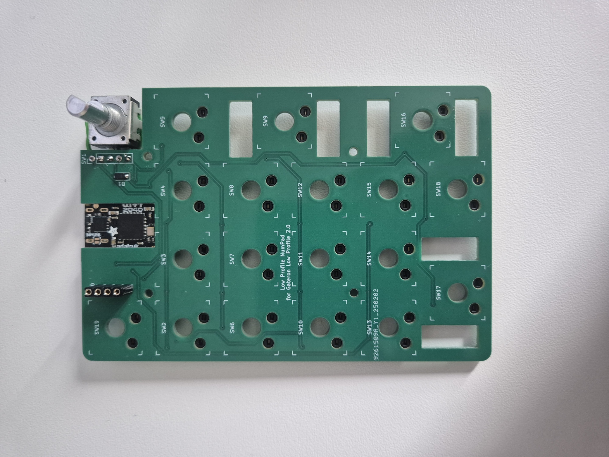
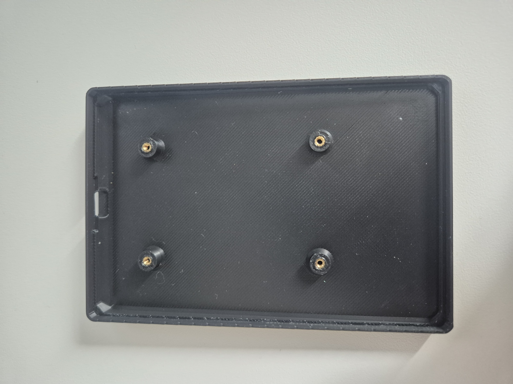
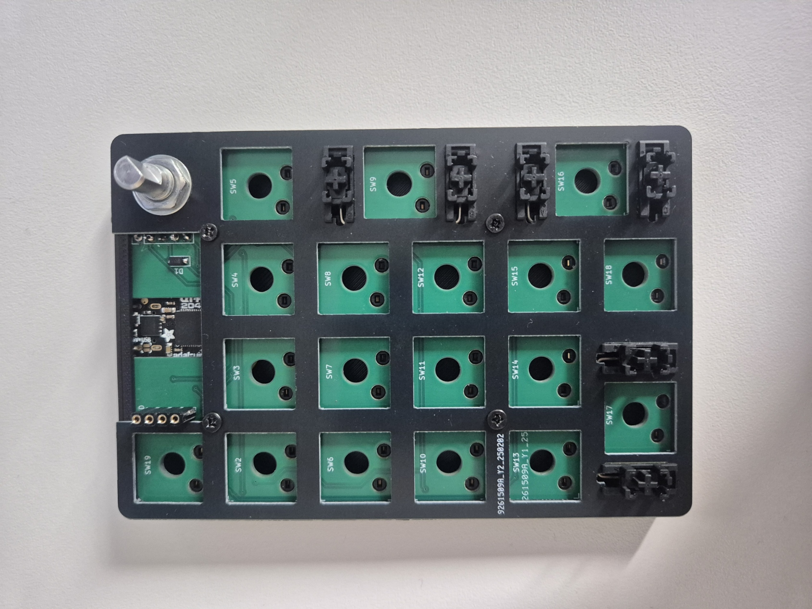

# Low Profile Numpad

for Gateron Low Profile 2.0 (KS-33) switches
Designed to fit in next to a Keychron K3 Max (or their other low profile keyboards)

## Design Process

The numpd was designed to match the outer dimensions of my Keychron K3 Max and use the same hotswap switches. The PCB was designed in [KiCad](https://github.com/KiCad), the case in Autodesk 
Fusion and the plate in [LibreCad](https://github.com/LibreCAD/LibreCAD) and imported into KiCad.
This was my first time designing a PCB, so the design is probably far from optimal. But it works!

Things to improve/do differently:
- Use the switches with a black housing to blend in with the black case
- Use original Keychron keycaps (if they sold them separately...)

## Building Materials

* Gateron [KS-33 Switches ](https://www.gateron.com/products/gateron-ks-33-low-profile-switch-set)
* Gateron [Low Profile Hotswap Sockets](https://www.gateron.com/products/gateron-low-profile-switch-hot-swap-pcb-socket)
* Gateron [Low Profile Stabilizers](https://www.gateron.com/products/gateron-low-profile-plate-mounted-stabilizer?VariantsId=10477)
* Wormier double-shot PBT keycaps [Aliexpress](https://aliexpress.com/item/1005008227731750.html)

* Adafruit [QT Py RP2040](https://www.adafruit.com/product/4900)
* 0.91" OLED Display (SSD1306) [Aliexpress](https://de.aliexpress.com/item/1005004622658983.html)
* Bourns PEC11R-4315F-S0012 [Encoder](https://www2.mouser.com/ProductDetail/652-PEC11R4315FS0012)
* PCBs ordered on [JLCPCB](https://jlcpcb.com/)
* M2 heat set inserts and screws

## Build Notes

PCBs ordered on [JLCPCB](https://jlcpcb.com/)
The main PCB is 1.6mm thick, the plate PCB is 1mm thick.
The parts were printed on a BambuLab A1 using their black PLA Basic filament.

The fit of the PCB is pretty tight, maybe it should've been a few millimetres wider.
There are holes for M2x3 heat set inserts in the case. I used black M2x8 screws with a flat, non-countersunk head.
I used a sharpie to paint the edge of the plate PCB black.
Use thin, flexible wires for the encoder since there's no a lot of space in the case
The cover for the OLED is only 0.6mm at the top, so it's very flimsy. If you have a smooth build plate print it upside down, I printed it using the top layer ironing feature with supports. The OLED is supposed to slide into the cover from the side. The fit is too tight, so use a small file to get it to fit perfectly.
There are 11mm diameter, 1.5mm deep holes on the botton where for small rubber feet can be stuck.

## Firmware

Since the numpad is using an RP2040 processor, I decided to use [KMK Firmware](https://github.com/KMKfw/kmk_firmware).
My programming knowledge is pretty limited and there aren't a lot of resources on KMK online, so I didn't figure out how to get the display to show Num- and Caps lock without using dummy layers as variables.

## Inspiration and resources

Inspiration for plate PCB and distances between keys: https://github.com/shanna/pla_nck

KiCad footprint for Gateron Low Profile hotswap sockets: https://gist.github.com/niw/22c68c2d7c869b990588b4875a654442 

## Gallery

.jpg)

